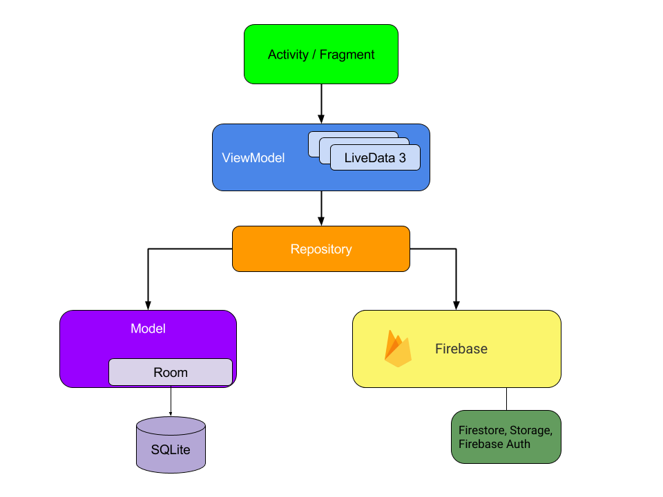

# EasyTo: TODO APP 📝
 Task management application developed with clean architecture, MVVM, ROOM, Firebase and SOLID principles

## Built With 🛠

- Kotlin
- Clean architecture
- MVVM
- Dagger Hilt
- Firebase (Firestore, Storage, Auth)
- Room
- Live Data
- Coroutines Flow
- ViewBinding
- Fragments/Activity's
- SOLID

## Architecture 📐



## Screenshots 📱

| Login Screen | Home |  Task details |
|:-:|:-:|:-:|
|  |  |  |
| Main Screen Dark | Detail Dark |  Favs Dark |
|  |  |  |

## Package Structure 📦

```bash

com.jcisneros.easyto # Root Package
├── di                  # Hilt DI Modules 
├── data                # For data handling.
│   ├── datasource      # Datasource for app
|   │   ├── firebase    # Firebase data sources
|   │   │   ├── auth    
|   │   │   ├── taskdetail
|   │   │   ├── tasks
|   │   ├── local       # Local Persistence Database.
|   │   │   ├── room    # Room (SQLite) database
|   │   │   │    ├── dao    
|   │   │   │    ├── database    
|   │   │   │    ├── entities
|   │   │   ├── auth    
|   │   │   ├── taskdetail
|   │   │   ├── tasks
|   │   ├── interfaces  # Interfaces for datasources implements
│   ├── model           # Data model for app
|
├── domain              # domain layer (for repository handling)
│   ├── repository      # Used to handle all data operations
|   │   ├── auth    
|   │   ├── taskdetail
|   │   ├── tasks
|
├── presentation        # Presentation layer (Activity/Fragment and VM)
│   ├── base            # To have classes with UI logic
│   ├── login           # Activity/Fragment, VM's
│   ├── taskdetail      # Activity/Fragment, VM's
│   ├── tasks           # Activity/Fragment, VM's and adapter
|
├── utils               # All utils class

```

## License 🔖
```
                               Apache License
                           Version 2.0, January 2004
                        http://www.apache.org/licenses/

   Copyright 2021 Juan Cisneros

   Licensed under the Apache License, Version 2.0 (the "License");
   you may not use this file except in compliance with the License.
   You may obtain a copy of the License at

       http://www.apache.org/licenses/LICENSE-2.0

   Unless required by applicable law or agreed to in writing, software
   distributed under the License is distributed on an "AS IS" BASIS,
   WITHOUT WARRANTIES OR CONDITIONS OF ANY KIND, either express or implied.
   See the License for the specific language governing permissions and
   limitations under the License.

```
